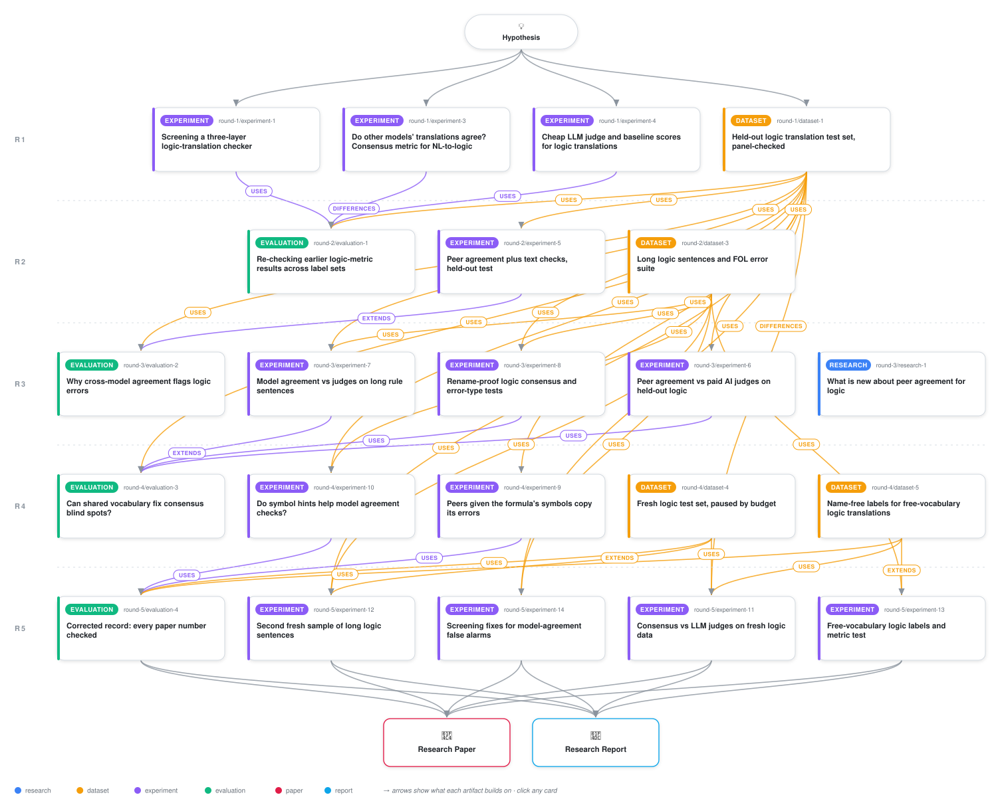

# Gold-Free Faithfulness Metrics for NL-to-FOL Translation

<div align="center">

<a href="https://cdn.jsdelivr.net/gh/ai-inventor-papers/ai-invention-eff060-layered-gold-free-checks-for-logic@fork/run_-tTYmHVAOMOt/workflow.svg">
<picture>
  <source media="(prefers-color-scheme: dark)" srcset="workflow-dark.svg">
  
</picture>
</a>

<sub>🖱️ <b><a href="https://cdn.jsdelivr.net/gh/ai-inventor-papers/ai-invention-eff060-layered-gold-free-checks-for-logic@fork/run_-tTYmHVAOMOt/workflow.svg">Open the interactive diagram</a></b> — every card links to its artifact folder.</sub>

</div>

> **TL;DR** — Cross-family solver consensus achieves AUROC 0.954 under shared predicate vocabulary (vs 0.587 for judges, pre-registered, flat with length) and 0.741 under free vocabulary (vs 0.642 for judges, development data). Free vocabulary costs ~0.15 AUROC and introduces a rename tradeoff. Confirmation on held-out data was budget-stopped.

<details>
<summary>Full hypothesis</summary>

kind: hypothesis (iteration 5 of 5, FINAL). Move = DEEPEN on the one live lead: cross-family solver consensus (frozen c_score_align, with PT = p_peer_text as its fused row). The lead gets its first test on data no earlier decision touched. The two confirmation sets that the budget broke in iteration 4 (E2, and the R_COMP FREE gloss labels) are each FIXED ONCE, with their claims unchanged. The lead's false-alarm cause, which iteration 4 re-diagnosed as wrong and scattered peers rather than vocabulary, is attacked with $0 development-screened variants. Candidate-Signature Consensus (CSC) is CLOSED. The paper is then written from the corrected record below.

========================================================================
0. CORRECTED RECORD (the paper step TRANSCRIBES these numbers; each has a source)
========================================================================

0.1 DATA ROLES
- E, the screen, R_COMP SIG and PERTURB are DEVELOPMENT data. Every number from them is development evidence. The paper must NEVER call E 'held-out'.
- The only untouched confirmation evidence is:
  - E2: sealed; seal.json and verify_seal.py are in gen_art_dataset_4;
  - the R_COMP FREE untouched subset (2,198 rows; seal b364a49a…, gen_art_dataset_5).

0.2 ITERATION 3, CORRECTED
The iter-3 record in iter_3/upd_hypo §0 is authoritative, together with the eval-3 Part-4 tables in gen_art_evaluation_3/tables/: hypothesis_verdicts_iter3.csv, perturb_corrected.csv, t2_record.csv, rename_selection_dead_end.csv, cost_units.csv, coverage_vs_request_iter3.csv, function_inventory.csv, label_facts.csv, corrections_iter12.csv, artifact_id_map.csv, prior_art.csv. Essentials:

T1 (art_7GxreYjATkC5), R_AB n = 2,686 (1,822 ERROR / 864 CORRECT, 292 sentences):
- c_score_align strat AUROC 0.741 vs flash-lite disguised 0.642: Δ +0.099 [0.049, 0.146].
  - long pool +0.116 [0.070, 0.163]; EXC +0.197; vs nano original +0.089 [0.043, 0.134].
- L25 (the user's priority stratum): Δ +0.069 [−0.020, 0.148], n.s.
- CTRL −0.069 [−0.23, 0.10].
- Against the baseline stack:
  - c alone ≈ S4_full: +0.006 [−0.031, 0.042];
  - nested [S4_full + c] − S4_full: strat +0.039 [0.021, 0.057].
- Frontier frame (n = 284):
  - AUROC: judge 0.741, S4_full 0.745, c 0.710;
  - ratio 0.957 [0.887, 1.034], so the 0.95 bar is met on the point estimate only;
  - nested +0.037 [0.008, 0.066].
- M3 is INCONCLUSIVE because its two specifications conflict: bootstrap +0.146 [−0.051, 0.361] vs stacked GEE +0.274 [0.190, 0.359].
- Flash-lite contamination DiD +0.105 [0.006, 0.201]: marginal evidence of contamination.
- Spend $2.395.

T2 (art_cxnoDYQNFolW), NOT CONFIRMED:
- SIG passes: 0.954 vs 0.587; +0.278 vs the original judge. But SIG is the controlled-vocabulary regime the user excluded.
- FREE was NOT_TESTABLE.
- [Correction, iter 4] The iter-3 FREE tier-A deltas (c_align − judge +0.214; 'falls to ~0.80') are VOID. Those labels over-call ERROR: 297 of 420 old ERROR rows are MAPPED (gen_art_dataset_5/results/old_label_agreement.json).

Exp 8 (art_YYD-HDzfQfEj):
- The pre-registered rename-invariant selection FAILED (HYB 0.841/0.700, NF 0.686/0.485).
- MEANING_RENAME is an ERROR operator, and c_nf is blind to it (0.499).
- Per-operator consensus AUROC is a base-endorsement artefact. Do not rank operators by it, and do not claim 'polarity symmetry'.
- Coverage 3,419 of 5,402 rows.
- Typing: peer-medoid 0.328 vs judge 0.326; the gold-using oracle reaches 0.802.

Eval 2 (art_FWy8D4_y9GBn), pre-registered definitions:
- M1 INCONCLUSIVE; M2 CONFIRMED but non-specific; M4 k95 = 3 overall, 2/3/5 by words tercile (long tercile = 5).
- NET +0.356 [0.198, 0.493]: consensus DEGRADES with length.
- SCATTER ratio 4.45; graded − binary +0.114.

Costs (cost_units.csv):
- consensus $1.21e-4 per candidate FULL;
- k = 1/3/5/7 pools: $0.000315 / 0.000946 / 0.001576 / 0.002206 per SENTENCE;
- flash-lite $4.9e-5 per call; frontier $3.65e-3 per item;
- SIG generation $0.000116 per candidate; MARGINAL z3 $2.5e-7.
- The old '$0.000024–0.000170 per sentence' column is wrong.

Prior art (art_VIF75I5R6f0v; needs its own section and marker in the paper):
- Not scooped. The method is not new: ARc 2511.09008 uses the same score form; NoTB 2608.21962; GenV 2609.11085 reports a label-target reversal; LLMs-as-Jury recommends 3-4 families.
- C1 and C3-C5 need qualifiers (prior_art.csv).
- Iter-3 spend $4.33 (not '$1.58 plus T1').

0.3 ITERATION 4, the record per artifact (spend from ledgers)

A. Exp 9, CSC on E (art_D7k2ZWgE3nVd; tables.md T0-T17; csc_gate_E.json). PROVISIONAL.
Population and selection:
- The platform refused paid calls after 1,033 of ~9,000 planned. PRIMARY is therefore a COMPLETION-SELECTED subset: 354 R_AB rows (196 ERROR / 158 CORRECT, 144 sentences).
- CTRL makes up 44.9% of PRIMARY CORRECT rows vs 27.4% on FULL.
- No stratum reaches 50/50, so L25 is NOT_READ.
- c_csc tie rate is 0.986.

Strat AUROC [CIs as in T4]:
| Metric | Strat AUROC |
|-|-|
| c_csc | 0.614 [0.493, 0.736] |
| FREE_exact (same 3 families) | 0.770 [0.686, 0.844] |
| FREE_ALIGN | 0.731 [0.635, 0.825] |
| c_score_align | 0.774 [0.682, 0.857] |
| p_peer_text | 0.799 [0.700, 0.880] |
| S4_full | 0.736 [0.635, 0.826] |
| flash-lite disguised | 0.664 [0.568, 0.750] |
| HYB_MEAN | 0.709 [0.586, 0.817] |

Paired Δ for c_csc (T5):
- vs FREE_exact −0.156 [−0.290, −0.031];
- vs c_score_align −0.160 [−0.275, −0.064];
- vs flash-lite −0.050 [−0.212, 0.107], n.s.;
- vs S4_full −0.123 [−0.269, 0.010], n.s.;
- phi-4 exemplar leakage removed (T17, 58 CSC calls copied the exemplar): c_csc_clean 0.639; vs FREE_exact −0.132 [−0.251, −0.023].

e and d:
- CSC e 0.459 vs FREE_exact 0.173; CSC d 0.139 vs 0.323.
- FULL T2: FREE_exact d 0.583 vs ALIGN 0.328.

Anchoring by class (T9, PRIMARY; e_CSC / e_FREE_exact / e_FREE_ALIGN):
| Class | e_CSC | e_FREE_exact | e_FREE_ALIGN |
|-|-|-|-|
| ADD | 0.490 | 0.135 | 0.375 |
| DROP | 0.472 | 0.169 | 0.380 |
| COMPOUND | 0.282 | 0.107 | 0.184 |
| MEANING_RENAME-type (n = 28) | 0.821 | 0.036 | 0.750 |
| structural | 0.336 | 0.153 | 0.282 |
| polarity | 0.200 | 0.133 | 0.200 |
- MEANING_RENAME-type Δ CSC − FREE_ALIGN is +0.071 [−0.083, 0.269], NOT_READ.
- FULL T9b: FREE_ALIGN e on MEANING_RENAME-type is 0.624, vs 0.104 for exact.
- READING: every vocabulary bridge (the aligner, or peers cued with the candidate's symbols) lowers d AND raises e, class by class. The aligner that c_score_align uses already endorses meaning-rename errors almost as often as CSC does.

Gates (the text of prereg_csc_E.json):
- G1 FAIL: d 0.139 ≤ 0.35, but the words slope is +1.25 [0.41, 2.09].
- G2 = 'strat ≥ c_score_align − 0.01 AND pooled > c_score_align on L25' → NOT_READ (the R_AB part FAILS; L25 Δ −0.067 [−0.183, 0.040], n = 81, not read).
- G3-E = RENAME_SYN false alarm: NOT_RUN.
- G4 null.
- G5 PASS: $5.25e-4 per candidate ($2.76e-4 deduped).

Length:
- M3 bootstrap −0.232 [−0.770, −0.023]; stacked GEE −0.351 [−0.694, −0.009].
- NET is length degradation WITHIN each arm, and every arm degrades: FULL FREE_exact +0.452, FREE_align +0.401.

Other tables:
- T8: 53% of free-exact disagreements with CORRECT candidates are structural; only 20.2% of flagged CORRECT rows are fully vocabulary-resolvable.
- T10 typing: own_majority 0.185, below the majority class 0.262.
- T14: CSC τ-b 0.256 (p = 0.25) vs c_score_align 0.513 (p = 0.015).
- T15: 9-peer c_score_align rename FA 0.595 → 0.868, ΔFA +0.273 [0.164, 0.384].
- Spend $0.108.
- Prior art: this is the correlated-failure mode of Chen & Avizienis 1978. What is new is the per-class e measurement and the bridge-trades-d-for-e table.

B. Exp 10, CSC on PERTURB (art_pAmLrGqsmFUx). BROKEN: 0 CSC peers were generated ($0.0000088). G3-P, G4 and MT are UNTESTED.
Zero-cost arms:
- SIGPROXY (out-of-scope controlled vocabulary): k = 3 within-template 0.930 [0.916, 0.943]; d 0.149 cued vs 0.757 uncued FREE3-ALIGN.
- Prior art for the shared-vocabulary lever: Vossel et al. 2025 ('predicate availability boosts performance by 15-20%') and ARc's fixed schema. The only addition here is a measured d reduction on long templated sentences, in an excluded regime.

CORRECTIONS:
- FREE-consensus mutant recall ≈ 1 comes with base FA at c > 0.5 of:
  - 0.712 (c_align_exp8, E);
  - 0.803 (FREE3_exact, E);
  - 0.986 (FREE3_exact, R_COMP);
  - 0.757 (FREE3_align, R_COMP).
  So that recall is trivial.
- Rename-control FA is mostly base FA. The paired flips are 0.18-0.53 (c_align E: SYN 0.182, NONCE 0.327).
- LOCAL2 e 0.341 comes entirely from insufficient-peer ties at c = 0.5 (e_excl 0.012/0.007).
- The judge's 12.4% mutant miss rate is NOT END_MAJ e.
- Typing:
  - 'oracle' repairs against the gold base, so it is NOT gold-free;
  - free3 on E is 0.123 [0.081, 0.169]; the pooled 0.085 includes R_COMP rows at 0.
- Split the controls by base source: FREE3_exact REORDER/CONTRA is 0.842/0.840 on E and 0.986 on R_COMP.
- Uncued d by words tercile: 0.47 / 0.80 / 0.91.

C. Dataset 4, E2 (art_2OmxzMInZZJY). BROKEN (budget stop).
- 550 sentences frozen: L25 350, EXC 100 (92 'without' + 8 'but not'; the core-exception supply is exhausted, D3), DT 100 (ProverQA).
- 30-sentence pilot: 300 candidates, labelled 36 ERROR / 274 UNRESOLVED (incl. gold-as-system) / 20 UNPARSEABLE / 0 CORRECT.
- Panel drift check:
  - the stop rule is UNDECIDED (passes = false; combined majority agreement 0.394);
  - synthetic gate items 0.974;
  - on 22 unambiguous track-H judgements, today's panel flags 0.12 of original errors vs 0.84 in E: a DRIFT WARNING on small n.
- Deviations D0-D7 must be listed.
- Spend $0.241.
- Power (eval 3):
  - L25 yield 0.37, so 350 L25 gives MDE80 0.110;
  - +0.069 on L25 needs ~882 planned sentences;
  - the long pool needs ~237 usable sentences.

D. Dataset 5, R_COMP FREE labels (art_Ia_FT284H33j). BROKEN for its purpose: the gloss step was not run, so the CORRECT class is empty.
- Search-only labels: ERROR_CERT 759, MAPPED 1,506, UNPARSEABLE 188, NO_OUTPUT 199.
- Search soundness: 0 of 1,595 false ERROR_CERT on SIG renames; known-ERROR rescue 9-10% (T8 0.27; T9 0.37-0.43).
- Audit: ERROR_CERT precision 0.867; MAPPED faithful 0.867. One MAPPED certificate swaps LivesIn and StudentInClass.
- Old iter-3 labels are contaminated by UP TO 70.7%. MAPPED is an upper bound. Old/new kappa is 0.058.
- D6 amended the map family after the freeze. Spend $0.

E. Eval 3 (art_BvAL_KZTZuw8), $0.
- MAIN FINDING: among pairs of a CORRECT candidate and a non-agreeing peer, 77% (9-family) / 61% (3-pool) of those peers are labelled ERROR. Only 9% of CORRECT-CORRECT disagreements are vocabulary-resolvable.
- Pair classes: IRREDUCIBLE 69.4%, EXACT 13.6%, ALIGN_ONLY 15.1%, VOCAB 1.6%.
- The no-anchoring oracle d floor:
  - 3-pool 0.385;
  - L25 0.542 vs END_MAJ 0.735;
  - 9-family 0.586 > END_MAJ 0.537, because most peers are wrong.
- The post-hoc instruments predict almost no fix: bracket [0.396, 0.415]; the gap_closed rule is ill-conditioned (denominator 0.013).
- The instruments are shown to UNDER-COUNT vocabulary effects: predicted endorsement 0.20 vs actual SIG 0.575, calibration error −0.372 [−0.423, −0.323].
  - SIG also changes granularity (D7), so the SIG−FREE agreement drop of +0.479 [0.447, 0.513] is an upper bound.
  - Non-transitivity (0.131) is a separate diagnostic.
- The number 0.683 is d under the exact rule on E's 3-pool. It is NOT an AUROC and NOT R_COMP. Delete 'theoretical AUROC 0.683'.
- c_vres on L25: −0.014 [−0.028, −0.001].
- NET DEGRADES under every rule (+0.35 to +0.39).
- VOCAB agreements are not label-specific.
- R_COMP FREE needs ≥ 200 CORRECT rows.

F. Iteration-4 spend: $0.108 + $0.0000088 + $0.241 + $0 + $0 ≈ $0.35. The rest of the $7 'Test idea' phase budget was consumed by processes recorded in NO iteration-4 artifact ledger. The paper states this and does not guess.

========================================================================
1. WHAT THE EVIDENCE NOW SAYS (the revised diagnosis)
========================================================================
The lead stands on development data: consensus beats cheap judges on long and exception sentences, and it adds signal over the stack only when nested. It is not confirmed on untouched data, and not on L25. The iteration-3 diagnosis said consensus fails on long sentences because CORRECT translations disagree about WORDS. Iteration 4 REFUTES that as the dominant cause on real LLM outputs (E):
- 61-77% of the disagreement a correct candidate meets comes from peers that are themselves WRONG;
- only 9% of correct-correct disagreement is vocabulary.
- Every vocabulary bridge trades d for e:
  - the aligner: d 0.583 → 0.328, but meaning-rename e 0.104 → 0.624;
  - candidate-signature cues: d → 0.139, but e → 0.459, the anchoring.
- CSC fails provisionally, and the aligner already carries much of the same anchoring cost.

Vocabulary divergence is real in templated free-vocabulary text (R_COMP: exact agreement 0.048 FREE vs 0.528 SIG). But on real long sentences the binding constraint is PEER ACCURACY: on L25 about 80% of candidates are wrong, so a correct candidate's class is a small plurality.

Candidate one-sentence finding, if iteration 5 confirms: 'Cross-family solver agreement is a gold-free faithfulness check that beats cheap LLM judges on long, conditioned sentences at ~$1e-4 per candidate. Where it fails, the cause is that the other models are wrong in different ways, not that correct translations use different words. Any device that makes peers share the candidate's vocabulary lowers false alarms only by making peers copy the candidate's errors.'

========================================================================
2. CLAIMS FOR ITERATION 5 (all metrics frozen and hashed BEFORE any confirmation label is joined)
========================================================================

H-PRIMARY (pre-declared in iteration 3; NOT re-selected). On E2 and on R_COMP FREE, the frozen c_score_align:
- uses the E2 10-slot pool, leave-own-family-out, with the exp-5 code byte-identical;
- is compared with the flash-lite rubric-A judge (disguised AND original) and with gpt-4.1-nano.
p_peer_text is a secondary row, frozen.

H-MECH (the label-based replication of the iter-4 diagnosis; no instrument needed). On E2 CORRECT candidates:
- (i) ≥ 50% of non-agreeing peers are labelled ERROR;
- (ii) SCATTER ratio SI_cor / SI_err ≥ 2;
- (iii) NET Δ(e+d) over the words terciles is > 0 (degradation replicates);
- (iv) exact vs ALIGN on E2 FULL reproduces the trade: ALIGN has lower d and higher e on MEANING_RENAME-type and ADD/DROP errors.

H-IMPROVE (the deepen on the cause; a DEVELOPMENT screen at $0, on E's stored pairwise matrix, 29,107 pairs). The mechanism is that wrong peers scatter (they agree with few others), so a correct candidate's plurality is diluted by them. So a score that discounts scattered or unreliable peers should lower d on long sentences WITHOUT raising e. Unlike CSC and the aligner, it changes no peer output and bridges no vocabulary.

Candidates screened, all label-free:
- V1 plurality-normalised: c_pn = 1 − share_agree / max_class_share among the sentence's peers;
- V2 reliability-weighted: per-family weights from mean pairwise agreement across ALL sentences (Dawid-Skene-style, label-free), estimated out of sentence fold;
- V3 = V1 + V2;
- V4 two-channel: a cross-fitted logistic on (c_exact, c_align), trading the aligner's d gain against its e cost;
- V5 V3 on the eval-2 best 3-pool (cost-matched, $0.001 per sentence);
- V0 the frozen c_score_align.

Selection rule (pre-registered before running):
- the winner is the variant with the highest E long-pool strat AUROC that
  - beats V0 by ≥ +0.015 there,
  - AND is ≥ V0 on L25 (point),
  - AND is ≥ V0 − 0.01 on CTRL.
- If none qualifies, NO variant is carried and V0 stands alone.
The winner is a CANDIDATE only; E2 confirms or kills it. Report how many variants were screened (5).

H-RENAME (the user's invariance requirement, the last attempt on a new mechanism, secondary budget). GLOSS-GATED name-free agreement (GG):
- A peer agrees with the candidate if they are exactly z3-equivalent, OR if an exhaustive injective symbol map (freelab.equivalent_modulo_vocab_exhaustive) yields equivalence AND a cheap LLM gloss check confirms every non-identity mapped symbol pair is a same-meaning pair in this sentence.
- This targets exactly why NF/HYB failed: NF cannot tell a synonym from a wrong predicate (0.388 of HYB's extra agreements are label-discordant; MEANING_RENAME 0.499). The gloss adds the lexical meaning test the solver lacks, without cueing peers, so there is no anchoring.
- The gloss model family for GG MUST differ from the one that labels R_COMP FREE (instrument-sharing firewall). GG is therefore never evaluated on R_COMP FREE.
- Dev gate on PERTURB E-bases plus E R_AB:
  - RENAME_SYN paired flip ≤ 0.05 and FA ≤ base FA + 0.05;
  - MEANING_RENAME recall at fixed threshold ≥ c_align's − 0.05;
  - E strat AUROC ≥ c_score_align − 0.01.
- Fail → rename non-invariance of consensus is reported as a measured boundary: c_align PERTURB NONCE/SYN FA 0.765/0.565 with paired flips 0.327/0.182; 9-peer ΔFA +0.273. No further rename work.

========================================================================
3. WORK ORDER AND BUDGET (each sweep costed before it runs; stop when the next sweep's estimate exceeds the remainder minus a 10% reserve)
========================================================================
P1. R_COMP FREE gloss (FIX ONCE; the panel route stays dropped). About $0.8-1.8.
- Gloss gate on the 840 known-answer items: balanced accuracy ≥ 0.90, per class reported.
- Then gloss the MAPPED rows → CORRECT / ERROR / UNRESOLVED, and seal.
- A Sonnet-5 audit only on a 120-row stratified sample.
- Out-of-family faithful forms (13% of ERROR_CERT) are carried as a label-noise bound; the AUROC is reported with and without those template classes.
- Testable only if ≥ 50 CORRECT rows; power is adequate at ≥ 200. The judge scores for FREE rows already exist from iter 3.

P2. E2 drift gate FIRST (~$0.3). Replay the full track-H set (192 judgements) with pinned model ids.
- PASS (flag rate on original errors within the CI of E's 0.84): E's frozen solver + panel protocol labels E2.
- FAIL: E2-L25/EXC labels are reported as DRIFTED (secondary), and the primary confirmation becomes R_COMP FREE plus E2-DT. DT is labelled by the alignment-free exhaustive-map + gloss labeller against the trusted prover-built gold.

P3. E2 generation for all 550 sentences (10 slots). Then the panel in the order L25 → EXC → DT, then the L25 surplus (98) if budget remains.
- The LONG POOL (L25 + EXC) is PRE-DECLARED PRIMARY, and its MDE (~0.11-0.12) is stated in advance.
- The 30 pilot sentences are included (sealed; never read by a selection step), and results are reported with and without them.

P4. Judges on E2: flash-lite disguised and original, and nano, on every parseable row (~$0.5). Also a local Qwen3-8B judge, L2-bow and the local round trip for S4_E2, which is cross-fitted by E2 sentence folds.

P5. The GG dev screen (gloss calls only on pairs where exact/ALIGN fail but a map exists; <$0.5).

P6. Frontier gemini-3.1-pro on a 300-row stratified E2 subsample (~$1.1). This is the first thing dropped if budget binds.

DROPPED:
- all remaining CSC arms (PERTURB G3-P/G4/MT, OTHER-SIG, multi-reading);
- any new dataset construction beyond E2;
- the SIG regime as evidence for the user's operating condition.

========================================================================
4. SUCCESS CRITERIA (fixed now)
========================================================================

CONFIRM (the lead becomes a finding):
- (a) E2 long pool: frozen c_score_align − flash-lite disguised strat CI > 0 AND point > 0 vs flash-lite original and nano.
- (b) E2 nested [S4_E2 + c] − S4_E2 strat CI > 0.
- (c) R_COMP FREE untouched (if testable): within-template c_score_align − flash-lite, disguised AND original, CI > 0. This is the first in-scope, free-vocabulary, trusted-reference test on long conditioned sentences.

PARTIAL:
- (a) holds, (c) is untestable or n.s.: confirmed on real long sentences, free-vocabulary templated text unresolved.
- (c) holds, (a) is n.s. with point ≥ +0.05: 'underpowered on E2, confirmed on R_COMP FREE'.

DISCONFIRM: the (a) point ≤ 0 on the E2 long pool. The E result was development-set optimism, and the judge/stack is the incumbent. This is reported plainly.

Also reported, not gating:
- L25 alone (expected MDE 0.11; the point estimate is stated with its power);
- DT sign (domain transfer);
- frontier ratio and nested gain on the 300-row subsample;
- system-level τ-b over 13 system × variant rows;
- rename FA and paired flip for c_score_align on E2 CORRECT rows under RENAME_SYN and RENAME_NONCE;
- coverage with unparseables in the denominator;
- $ and seconds per candidate, FULL vs MARGINAL.

H-MECH is scored CONFIRMED or REFUTED per item (i)-(iv).

H-IMPROVE: the carried variant − V0 on the E2 long pool, strat CI > 0 → CONFIRMED improvement; otherwise V0 stands and the variant is reported as a development-only result.

H-RENAME: CONFIRMED only if GG passed the dev gate AND on E2 CORRECT rows its RENAME_SYN paired flip is ≤ 0.05 while its E2 long-pool AUROC is ≥ c_score_align − 0.01.

ERROR TYPE (the user's 'which kind of error'):
- The answer is NEGATIVE outside a shared vocabulary: free3 0.123 on E; medoid 0.328 vs judge 0.326.
- Within a shared vocabulary, typed repair reaches 0.784 (SIGPROXY), but that regime is out of scope.
- No new budget.

========================================================================
5. PAPER OBLIGATIONS (all transcription; blocking review items)
========================================================================
- Apply eval-3 Part 4 in place. Each corrected item gets a '[Correction, iter 4: …; source <path>]' marker next to the struck original text:
  - §3.4 from perturb_corrected.csv: MEANING_RENAME = an ERROR operator; per-operator consensus AUROC = base endorsement; the judge cells from perturb_sensitivity.csv; coverage 3,419/5,402;
  - §3.3 from t2_record.csv: T2 NOT CONFIRMED, and the FREE deltas are void;
  - §3.5 with the pre-registered M1-M4, NET +0.356, and cost_units.csv;
  - the iter-1/2 items in corrections_iter12.csv: frontier C4 'strengthens'; the 588 common items; 'fitted under solver labels'.
- Replace the placeholder artifact IDs from artifact_id_map.csv.
- Add the following sections and tables:
  - '3.7 Hypothesis verdicts';
  - 'Prior-art positioning [ARTIFACT:art_VIF75I5R6f0v]': scoop rule, neighbour table, C1-C5 verdicts;
  - the coverage-against-request table, with one-line answers: long sentences → pending E2; no controlled vocabulary → pending R_COMP FREE; error type → negative;
  - the function inventory;
  - ONE cost table with units;
  - the iteration-4 spend table (§0.3F);
  - a reasoning block at the start of §3 and §4 (previous review score and blocking status, move, prediction, gates, planned vs actual artifacts).
- Rewrite §4.2-4.6 from §0.3A-E exactly, with CIs copied verbatim. 'CSC is a dead end' becomes 'provisional negative on a completion-selected subset; L25 and RENAME untested'.
- Extend the dead-ends table:
  - rename-invariant selection (NF/HYB INELIGIBLE);
  - candidate B1 (never ran);
  - the FOL-Triage rewrite-FA gate;
  - P2 and P4 REFUTED;
  - CSC_graded, CSC_multi and HYB_MEAN (all fail G1);
  - E2 EXC-core supply;
  - correct the c_nf reason to 'selection failure + MEANING_RENAME blindness'.
- 'What we have learned' must drop '0.954 on R_COMP' and '96% of frontier' as headlines, or caveat them (out-of-scope SIG; point estimate only). It must state the long-tercile k95 = 5.

========================================================================
6. CARRIED AS SECONDARY ROWS; CLOSED
========================================================================
Secondary rows: PT, TEXT (L2-bow + L3), NF/HYB, graded consensus, S4 stacks, round trip, SC-5, pilot structural metrics, the local judges.

CLOSED, one sentence each in the paper:
- CSC and all its arms;
- post-hoc NF/HYB as a rename fix;
- the panel route for R_COMP FREE;
- per-operator within-base AUROC for consensus;
- B1/B2; R_ADJ; L1 lint and L2-role on LLM outputs;
- the vocabulary-divergence diagnosis of iteration 3 (refuted on E by the label-based decomposition).

DELIVERABLE FUNCTIONS:
- consensus_score(mode = align | exact | nf | hyb | pn | rw | gg);
- graded_consensus;
- pairwise_matrix / ed_decomposition;
- exhaustive_map_label + gloss_decision (the labelling tools);
- equivalent_modulo_vocab(_exhaustive);
- minimal_typed_repair;
- fol_triage;
- peer_text.
Each has a one-line statement of what it measures, and each is marked gold-free or gold-using.

</details>

[](https://ai-inventor-papers.github.io/ai-invention-eff060-layered-gold-free-checks-for-logic/fork/run_-tTYmHVAOMOt/) [](https://ai-inventor-papers.github.io/ai-invention-eff060-layered-gold-free-checks-for-logic/fork/run_-tTYmHVAOMOt/interactive.html)

[](https://cdn.jsdelivr.net/gh/ai-inventor-papers/ai-invention-eff060-layered-gold-free-checks-for-logic@fork/run_-tTYmHVAOMOt/paper.pdf) [](https://cdn.jsdelivr.net/gh/ai-inventor-papers/ai-invention-eff060-layered-gold-free-checks-for-logic@fork/run_-tTYmHVAOMOt/report.pdf) [](https://cdn.jsdelivr.net/gh/ai-inventor-papers/ai-invention-eff060-layered-gold-free-checks-for-logic@fork/run_-tTYmHVAOMOt/round-5/report.pdf) [](https://github.com/ai-inventor-papers/ai-invention-eff060-layered-gold-free-checks-for-logic/tree/fork/run_-tTYmHVAOMOt/paper_latex)

This repository contains all **22 artifacts** produced across **5 rounds** of an autonomous AI research run — round by round, exactly in the order they were invented.

## Round 1

| Artifact | Type | Demo | Source | Builds on |
|----------|------|------|--------|-----------|
| **[Screening a three-layer logic-translation checker](https://github.com/ai-inventor-papers/ai-invention-eff060-layered-gold-free-checks-for-logic/tree/fork/run_-tTYmHVAOMOt/round-1/experiment-1)** | [](https://github.com/ai-inventor-papers/ai-invention-eff060-layered-gold-free-checks-for-logic/tree/fork/run_-tTYmHVAOMOt/round-1/experiment-1) | [](https://colab.research.google.com/github/ai-inventor-papers/ai-invention-eff060-layered-gold-free-checks-for-logic/blob/fork/run_-tTYmHVAOMOt/round-1/experiment-1/demo/method_code_demo.ipynb) | [](https://github.com/ai-inventor-papers/ai-invention-eff060-layered-gold-free-checks-for-logic/tree/fork/run_-tTYmHVAOMOt/round-1/experiment-1/src) | — |
| **[Do other models' translations agree? Consensus metric for NL…](https://github.com/ai-inventor-papers/ai-invention-eff060-layered-gold-free-checks-for-logic/tree/fork/run_-tTYmHVAOMOt/round-1/experiment-3)** | [](https://github.com/ai-inventor-papers/ai-invention-eff060-layered-gold-free-checks-for-logic/tree/fork/run_-tTYmHVAOMOt/round-1/experiment-3) | [](https://colab.research.google.com/github/ai-inventor-papers/ai-invention-eff060-layered-gold-free-checks-for-logic/blob/fork/run_-tTYmHVAOMOt/round-1/experiment-3/demo/method_code_demo.ipynb) | [](https://github.com/ai-inventor-papers/ai-invention-eff060-layered-gold-free-checks-for-logic/tree/fork/run_-tTYmHVAOMOt/round-1/experiment-3/src) | — |
| **[Cheap LLM judge and baseline scores for logic translations](https://github.com/ai-inventor-papers/ai-invention-eff060-layered-gold-free-checks-for-logic/tree/fork/run_-tTYmHVAOMOt/round-1/experiment-4)** | [](https://github.com/ai-inventor-papers/ai-invention-eff060-layered-gold-free-checks-for-logic/tree/fork/run_-tTYmHVAOMOt/round-1/experiment-4) | [](https://colab.research.google.com/github/ai-inventor-papers/ai-invention-eff060-layered-gold-free-checks-for-logic/blob/fork/run_-tTYmHVAOMOt/round-1/experiment-4/demo/method_code_demo.ipynb) | [](https://github.com/ai-inventor-papers/ai-invention-eff060-layered-gold-free-checks-for-logic/tree/fork/run_-tTYmHVAOMOt/round-1/experiment-4/src) | — |
| **[Held-out logic translation test set, panel-checked](https://github.com/ai-inventor-papers/ai-invention-eff060-layered-gold-free-checks-for-logic/tree/fork/run_-tTYmHVAOMOt/round-1/dataset-1)** | [](https://github.com/ai-inventor-papers/ai-invention-eff060-layered-gold-free-checks-for-logic/tree/fork/run_-tTYmHVAOMOt/round-1/dataset-1) | [](https://colab.research.google.com/github/ai-inventor-papers/ai-invention-eff060-layered-gold-free-checks-for-logic/blob/fork/run_-tTYmHVAOMOt/round-1/dataset-1/demo/data_code_demo.ipynb) | [](https://github.com/ai-inventor-papers/ai-invention-eff060-layered-gold-free-checks-for-logic/tree/fork/run_-tTYmHVAOMOt/round-1/dataset-1/src) | — |

## Round 2

| Artifact | Type | Demo | Source | Builds on |
|----------|------|------|--------|-----------|
| **[Peer agreement plus text checks, held-out test](https://github.com/ai-inventor-papers/ai-invention-eff060-layered-gold-free-checks-for-logic/tree/fork/run_-tTYmHVAOMOt/round-2/experiment-5)** | [](https://github.com/ai-inventor-papers/ai-invention-eff060-layered-gold-free-checks-for-logic/tree/fork/run_-tTYmHVAOMOt/round-2/experiment-5) | [](https://colab.research.google.com/github/ai-inventor-papers/ai-invention-eff060-layered-gold-free-checks-for-logic/blob/fork/run_-tTYmHVAOMOt/round-2/experiment-5/demo/method_code_demo.ipynb) | [](https://github.com/ai-inventor-papers/ai-invention-eff060-layered-gold-free-checks-for-logic/tree/fork/run_-tTYmHVAOMOt/round-2/experiment-5/src) | <sub><i>uses:</i><br/>[dataset‑1&nbsp;(R1)](https://github.com/ai-inventor-papers/ai-invention-eff060-layered-gold-free-checks-for-logic/tree/fork/run_-tTYmHVAOMOt/round-1/dataset-1)</sub> |
| **[Long logic sentences and FOL error suite](https://github.com/ai-inventor-papers/ai-invention-eff060-layered-gold-free-checks-for-logic/tree/fork/run_-tTYmHVAOMOt/round-2/dataset-3)** | [](https://github.com/ai-inventor-papers/ai-invention-eff060-layered-gold-free-checks-for-logic/tree/fork/run_-tTYmHVAOMOt/round-2/dataset-3) | — | [](https://github.com/ai-inventor-papers/ai-invention-eff060-layered-gold-free-checks-for-logic/tree/fork/run_-tTYmHVAOMOt/round-2/dataset-3/src) | — |
| **[Re-checking earlier logic-metric results across label sets](https://github.com/ai-inventor-papers/ai-invention-eff060-layered-gold-free-checks-for-logic/tree/fork/run_-tTYmHVAOMOt/round-2/evaluation-1)** | [](https://github.com/ai-inventor-papers/ai-invention-eff060-layered-gold-free-checks-for-logic/tree/fork/run_-tTYmHVAOMOt/round-2/evaluation-1) | — | [](https://github.com/ai-inventor-papers/ai-invention-eff060-layered-gold-free-checks-for-logic/tree/fork/run_-tTYmHVAOMOt/round-2/evaluation-1/src) | <sub><i>uses:</i><br/>[experiment‑1&nbsp;(R1)](https://github.com/ai-inventor-papers/ai-invention-eff060-layered-gold-free-checks-for-logic/tree/fork/run_-tTYmHVAOMOt/round-1/experiment-1)<br/>[experiment‑4&nbsp;(R1)](https://github.com/ai-inventor-papers/ai-invention-eff060-layered-gold-free-checks-for-logic/tree/fork/run_-tTYmHVAOMOt/round-1/experiment-4)<br/>[dataset‑1&nbsp;(R1)](https://github.com/ai-inventor-papers/ai-invention-eff060-layered-gold-free-checks-for-logic/tree/fork/run_-tTYmHVAOMOt/round-1/dataset-1)<br/><i>differences:</i><br/>[experiment‑3&nbsp;(R1)](https://github.com/ai-inventor-papers/ai-invention-eff060-layered-gold-free-checks-for-logic/tree/fork/run_-tTYmHVAOMOt/round-1/experiment-3)</sub> |

## Round 3

| Artifact | Type | Demo | Source | Builds on |
|----------|------|------|--------|-----------|
| **[Peer agreement vs paid AI judges on held-out logic](https://github.com/ai-inventor-papers/ai-invention-eff060-layered-gold-free-checks-for-logic/tree/fork/run_-tTYmHVAOMOt/round-3/experiment-6)** | [](https://github.com/ai-inventor-papers/ai-invention-eff060-layered-gold-free-checks-for-logic/tree/fork/run_-tTYmHVAOMOt/round-3/experiment-6) | [](https://colab.research.google.com/github/ai-inventor-papers/ai-invention-eff060-layered-gold-free-checks-for-logic/blob/fork/run_-tTYmHVAOMOt/round-3/experiment-6/demo/method_code_demo.ipynb) | [](https://github.com/ai-inventor-papers/ai-invention-eff060-layered-gold-free-checks-for-logic/tree/fork/run_-tTYmHVAOMOt/round-3/experiment-6/src) | <sub><i>uses:</i><br/>[dataset‑1&nbsp;(R1)](https://github.com/ai-inventor-papers/ai-invention-eff060-layered-gold-free-checks-for-logic/tree/fork/run_-tTYmHVAOMOt/round-1/dataset-1)</sub> |
| **[Model agreement vs judges on long rule sentences](https://github.com/ai-inventor-papers/ai-invention-eff060-layered-gold-free-checks-for-logic/tree/fork/run_-tTYmHVAOMOt/round-3/experiment-7)** | [](https://github.com/ai-inventor-papers/ai-invention-eff060-layered-gold-free-checks-for-logic/tree/fork/run_-tTYmHVAOMOt/round-3/experiment-7) | [](https://colab.research.google.com/github/ai-inventor-papers/ai-invention-eff060-layered-gold-free-checks-for-logic/blob/fork/run_-tTYmHVAOMOt/round-3/experiment-7/demo/method_code_demo.ipynb) | [](https://github.com/ai-inventor-papers/ai-invention-eff060-layered-gold-free-checks-for-logic/tree/fork/run_-tTYmHVAOMOt/round-3/experiment-7/src) | <sub><i>uses:</i><br/>[dataset‑3&nbsp;(R2)](https://github.com/ai-inventor-papers/ai-invention-eff060-layered-gold-free-checks-for-logic/tree/fork/run_-tTYmHVAOMOt/round-2/dataset-3)<br/>[dataset‑1&nbsp;(R1)](https://github.com/ai-inventor-papers/ai-invention-eff060-layered-gold-free-checks-for-logic/tree/fork/run_-tTYmHVAOMOt/round-1/dataset-1)</sub> |
| **[Rename-proof logic consensus and error-type tests](https://github.com/ai-inventor-papers/ai-invention-eff060-layered-gold-free-checks-for-logic/tree/fork/run_-tTYmHVAOMOt/round-3/experiment-8)** | [](https://github.com/ai-inventor-papers/ai-invention-eff060-layered-gold-free-checks-for-logic/tree/fork/run_-tTYmHVAOMOt/round-3/experiment-8) | [](https://colab.research.google.com/github/ai-inventor-papers/ai-invention-eff060-layered-gold-free-checks-for-logic/blob/fork/run_-tTYmHVAOMOt/round-3/experiment-8/demo/method_code_demo.ipynb) | [](https://github.com/ai-inventor-papers/ai-invention-eff060-layered-gold-free-checks-for-logic/tree/fork/run_-tTYmHVAOMOt/round-3/experiment-8/src) | <sub><i>uses:</i><br/>[dataset‑3&nbsp;(R2)](https://github.com/ai-inventor-papers/ai-invention-eff060-layered-gold-free-checks-for-logic/tree/fork/run_-tTYmHVAOMOt/round-2/dataset-3)<br/>[dataset‑1&nbsp;(R1)](https://github.com/ai-inventor-papers/ai-invention-eff060-layered-gold-free-checks-for-logic/tree/fork/run_-tTYmHVAOMOt/round-1/dataset-1)</sub> |
| **[Why cross-model agreement flags logic errors](https://github.com/ai-inventor-papers/ai-invention-eff060-layered-gold-free-checks-for-logic/tree/fork/run_-tTYmHVAOMOt/round-3/evaluation-2)** | [](https://github.com/ai-inventor-papers/ai-invention-eff060-layered-gold-free-checks-for-logic/tree/fork/run_-tTYmHVAOMOt/round-3/evaluation-2) | — | [](https://github.com/ai-inventor-papers/ai-invention-eff060-layered-gold-free-checks-for-logic/tree/fork/run_-tTYmHVAOMOt/round-3/evaluation-2/src) | <sub><i>extends:</i><br/>[experiment‑5&nbsp;(R2)](https://github.com/ai-inventor-papers/ai-invention-eff060-layered-gold-free-checks-for-logic/tree/fork/run_-tTYmHVAOMOt/round-2/experiment-5)<br/><i>uses:</i><br/>[dataset‑1&nbsp;(R1)](https://github.com/ai-inventor-papers/ai-invention-eff060-layered-gold-free-checks-for-logic/tree/fork/run_-tTYmHVAOMOt/round-1/dataset-1)</sub> |
| **[What is new about peer agreement for logic](https://github.com/ai-inventor-papers/ai-invention-eff060-layered-gold-free-checks-for-logic/tree/fork/run_-tTYmHVAOMOt/round-3/research-1)** | [](https://github.com/ai-inventor-papers/ai-invention-eff060-layered-gold-free-checks-for-logic/tree/fork/run_-tTYmHVAOMOt/round-3/research-1) | [](https://github.com/ai-inventor-papers/ai-invention-eff060-layered-gold-free-checks-for-logic/blob/fork/run_-tTYmHVAOMOt/round-3/research-1/demo/research_demo.md) | [](https://github.com/ai-inventor-papers/ai-invention-eff060-layered-gold-free-checks-for-logic/tree/fork/run_-tTYmHVAOMOt/round-3/research-1/src) | — |

## Round 4

| Artifact | Type | Demo | Source | Builds on |
|----------|------|------|--------|-----------|
| **[Peers given the formula's symbols copy its errors](https://github.com/ai-inventor-papers/ai-invention-eff060-layered-gold-free-checks-for-logic/tree/fork/run_-tTYmHVAOMOt/round-4/experiment-9)** | [](https://github.com/ai-inventor-papers/ai-invention-eff060-layered-gold-free-checks-for-logic/tree/fork/run_-tTYmHVAOMOt/round-4/experiment-9) | — | [](https://github.com/ai-inventor-papers/ai-invention-eff060-layered-gold-free-checks-for-logic/tree/fork/run_-tTYmHVAOMOt/round-4/experiment-9/src) | <sub><i>uses:</i><br/>[dataset‑1&nbsp;(R1)](https://github.com/ai-inventor-papers/ai-invention-eff060-layered-gold-free-checks-for-logic/tree/fork/run_-tTYmHVAOMOt/round-1/dataset-1)</sub> |
| **[Do symbol hints help model agreement checks?](https://github.com/ai-inventor-papers/ai-invention-eff060-layered-gold-free-checks-for-logic/tree/fork/run_-tTYmHVAOMOt/round-4/experiment-10)** | [](https://github.com/ai-inventor-papers/ai-invention-eff060-layered-gold-free-checks-for-logic/tree/fork/run_-tTYmHVAOMOt/round-4/experiment-10) | [](https://colab.research.google.com/github/ai-inventor-papers/ai-invention-eff060-layered-gold-free-checks-for-logic/blob/fork/run_-tTYmHVAOMOt/round-4/experiment-10/demo/method_code_demo.ipynb) | [](https://github.com/ai-inventor-papers/ai-invention-eff060-layered-gold-free-checks-for-logic/tree/fork/run_-tTYmHVAOMOt/round-4/experiment-10/src) | <sub><i>uses:</i><br/>[dataset‑3&nbsp;(R2)](https://github.com/ai-inventor-papers/ai-invention-eff060-layered-gold-free-checks-for-logic/tree/fork/run_-tTYmHVAOMOt/round-2/dataset-3)<br/>[dataset‑1&nbsp;(R1)](https://github.com/ai-inventor-papers/ai-invention-eff060-layered-gold-free-checks-for-logic/tree/fork/run_-tTYmHVAOMOt/round-1/dataset-1)</sub> |
| **[Fresh logic test set, paused by budget](https://github.com/ai-inventor-papers/ai-invention-eff060-layered-gold-free-checks-for-logic/tree/fork/run_-tTYmHVAOMOt/round-4/dataset-4)** | [](https://github.com/ai-inventor-papers/ai-invention-eff060-layered-gold-free-checks-for-logic/tree/fork/run_-tTYmHVAOMOt/round-4/dataset-4) | [](https://colab.research.google.com/github/ai-inventor-papers/ai-invention-eff060-layered-gold-free-checks-for-logic/blob/fork/run_-tTYmHVAOMOt/round-4/dataset-4/demo/data_code_demo.ipynb) | [](https://github.com/ai-inventor-papers/ai-invention-eff060-layered-gold-free-checks-for-logic/tree/fork/run_-tTYmHVAOMOt/round-4/dataset-4/src) | — |
| **[Name-free labels for free-vocabulary logic translations](https://github.com/ai-inventor-papers/ai-invention-eff060-layered-gold-free-checks-for-logic/tree/fork/run_-tTYmHVAOMOt/round-4/dataset-5)** | [](https://github.com/ai-inventor-papers/ai-invention-eff060-layered-gold-free-checks-for-logic/tree/fork/run_-tTYmHVAOMOt/round-4/dataset-5) | [](https://colab.research.google.com/github/ai-inventor-papers/ai-invention-eff060-layered-gold-free-checks-for-logic/blob/fork/run_-tTYmHVAOMOt/round-4/dataset-5/demo/data_code_demo.ipynb) | [](https://github.com/ai-inventor-papers/ai-invention-eff060-layered-gold-free-checks-for-logic/tree/fork/run_-tTYmHVAOMOt/round-4/dataset-5/src) | — |
| **[Can shared vocabulary fix consensus blind spots?](https://github.com/ai-inventor-papers/ai-invention-eff060-layered-gold-free-checks-for-logic/tree/fork/run_-tTYmHVAOMOt/round-4/evaluation-3)** | [](https://github.com/ai-inventor-papers/ai-invention-eff060-layered-gold-free-checks-for-logic/tree/fork/run_-tTYmHVAOMOt/round-4/evaluation-3) | [](https://colab.research.google.com/github/ai-inventor-papers/ai-invention-eff060-layered-gold-free-checks-for-logic/blob/fork/run_-tTYmHVAOMOt/round-4/evaluation-3/demo/eval_code_demo.ipynb) | [](https://github.com/ai-inventor-papers/ai-invention-eff060-layered-gold-free-checks-for-logic/tree/fork/run_-tTYmHVAOMOt/round-4/evaluation-3/src) | <sub><i>uses:</i><br/>[experiment‑6&nbsp;(R3)](https://github.com/ai-inventor-papers/ai-invention-eff060-layered-gold-free-checks-for-logic/tree/fork/run_-tTYmHVAOMOt/round-3/experiment-6)<br/>[experiment‑8&nbsp;(R3)](https://github.com/ai-inventor-papers/ai-invention-eff060-layered-gold-free-checks-for-logic/tree/fork/run_-tTYmHVAOMOt/round-3/experiment-8)<br/>[dataset‑1&nbsp;(R1)](https://github.com/ai-inventor-papers/ai-invention-eff060-layered-gold-free-checks-for-logic/tree/fork/run_-tTYmHVAOMOt/round-1/dataset-1)<br/><i>extends:</i><br/>[experiment‑7&nbsp;(R3)](https://github.com/ai-inventor-papers/ai-invention-eff060-layered-gold-free-checks-for-logic/tree/fork/run_-tTYmHVAOMOt/round-3/experiment-7)</sub> |

## Round 5

| Artifact | Type | Demo | Source | Builds on |
|----------|------|------|--------|-----------|
| **[Consensus vs LLM judges on fresh logic data](https://github.com/ai-inventor-papers/ai-invention-eff060-layered-gold-free-checks-for-logic/tree/fork/run_-tTYmHVAOMOt/round-5/experiment-11)** | [](https://github.com/ai-inventor-papers/ai-invention-eff060-layered-gold-free-checks-for-logic/tree/fork/run_-tTYmHVAOMOt/round-5/experiment-11) | — | [](https://github.com/ai-inventor-papers/ai-invention-eff060-layered-gold-free-checks-for-logic/tree/fork/run_-tTYmHVAOMOt/round-5/experiment-11/src) | <sub><i>uses:</i><br/>[dataset‑4&nbsp;(R4)](https://github.com/ai-inventor-papers/ai-invention-eff060-layered-gold-free-checks-for-logic/tree/fork/run_-tTYmHVAOMOt/round-4/dataset-4)<br/>[dataset‑5&nbsp;(R4)](https://github.com/ai-inventor-papers/ai-invention-eff060-layered-gold-free-checks-for-logic/tree/fork/run_-tTYmHVAOMOt/round-4/dataset-5)<br/><i>differences:</i><br/>[dataset‑1&nbsp;(R1)](https://github.com/ai-inventor-papers/ai-invention-eff060-layered-gold-free-checks-for-logic/tree/fork/run_-tTYmHVAOMOt/round-1/dataset-1)</sub> |
| **[Second fresh sample of long logic sentences](https://github.com/ai-inventor-papers/ai-invention-eff060-layered-gold-free-checks-for-logic/tree/fork/run_-tTYmHVAOMOt/round-5/experiment-12)** | [](https://github.com/ai-inventor-papers/ai-invention-eff060-layered-gold-free-checks-for-logic/tree/fork/run_-tTYmHVAOMOt/round-5/experiment-12) | — | [](https://github.com/ai-inventor-papers/ai-invention-eff060-layered-gold-free-checks-for-logic/tree/fork/run_-tTYmHVAOMOt/round-5/experiment-12/src) | <sub><i>extends:</i><br/>[dataset‑4&nbsp;(R4)](https://github.com/ai-inventor-papers/ai-invention-eff060-layered-gold-free-checks-for-logic/tree/fork/run_-tTYmHVAOMOt/round-4/dataset-4)<br/><i>uses:</i><br/>[dataset‑1&nbsp;(R1)](https://github.com/ai-inventor-papers/ai-invention-eff060-layered-gold-free-checks-for-logic/tree/fork/run_-tTYmHVAOMOt/round-1/dataset-1)<br/>[dataset‑3&nbsp;(R2)](https://github.com/ai-inventor-papers/ai-invention-eff060-layered-gold-free-checks-for-logic/tree/fork/run_-tTYmHVAOMOt/round-2/dataset-3)</sub> |
| **[Free-vocabulary logic labels and metric test](https://github.com/ai-inventor-papers/ai-invention-eff060-layered-gold-free-checks-for-logic/tree/fork/run_-tTYmHVAOMOt/round-5/experiment-13)** | [](https://github.com/ai-inventor-papers/ai-invention-eff060-layered-gold-free-checks-for-logic/tree/fork/run_-tTYmHVAOMOt/round-5/experiment-13) | — | [](https://github.com/ai-inventor-papers/ai-invention-eff060-layered-gold-free-checks-for-logic/tree/fork/run_-tTYmHVAOMOt/round-5/experiment-13/src) | <sub><i>extends:</i><br/>[dataset‑5&nbsp;(R4)](https://github.com/ai-inventor-papers/ai-invention-eff060-layered-gold-free-checks-for-logic/tree/fork/run_-tTYmHVAOMOt/round-4/dataset-5)<br/><i>uses:</i><br/>[dataset‑3&nbsp;(R2)](https://github.com/ai-inventor-papers/ai-invention-eff060-layered-gold-free-checks-for-logic/tree/fork/run_-tTYmHVAOMOt/round-2/dataset-3)</sub> |
| **[Screening fixes for model-agreement false alarms](https://github.com/ai-inventor-papers/ai-invention-eff060-layered-gold-free-checks-for-logic/tree/fork/run_-tTYmHVAOMOt/round-5/experiment-14)** | [](https://github.com/ai-inventor-papers/ai-invention-eff060-layered-gold-free-checks-for-logic/tree/fork/run_-tTYmHVAOMOt/round-5/experiment-14) | [](https://colab.research.google.com/github/ai-inventor-papers/ai-invention-eff060-layered-gold-free-checks-for-logic/blob/fork/run_-tTYmHVAOMOt/round-5/experiment-14/demo/method_code_demo.ipynb) | [](https://github.com/ai-inventor-papers/ai-invention-eff060-layered-gold-free-checks-for-logic/tree/fork/run_-tTYmHVAOMOt/round-5/experiment-14/src) | <sub><i>uses:</i><br/>[dataset‑1&nbsp;(R1)](https://github.com/ai-inventor-papers/ai-invention-eff060-layered-gold-free-checks-for-logic/tree/fork/run_-tTYmHVAOMOt/round-1/dataset-1)<br/>[dataset‑3&nbsp;(R2)](https://github.com/ai-inventor-papers/ai-invention-eff060-layered-gold-free-checks-for-logic/tree/fork/run_-tTYmHVAOMOt/round-2/dataset-3)</sub> |
| **[Corrected record: every paper number checked](https://github.com/ai-inventor-papers/ai-invention-eff060-layered-gold-free-checks-for-logic/tree/fork/run_-tTYmHVAOMOt/round-5/evaluation-4)** | [](https://github.com/ai-inventor-papers/ai-invention-eff060-layered-gold-free-checks-for-logic/tree/fork/run_-tTYmHVAOMOt/round-5/evaluation-4) | [](https://colab.research.google.com/github/ai-inventor-papers/ai-invention-eff060-layered-gold-free-checks-for-logic/blob/fork/run_-tTYmHVAOMOt/round-5/evaluation-4/demo/eval_code_demo.ipynb) | [](https://github.com/ai-inventor-papers/ai-invention-eff060-layered-gold-free-checks-for-logic/tree/fork/run_-tTYmHVAOMOt/round-5/evaluation-4/src) | <sub><i>uses:</i><br/>[experiment‑9&nbsp;(R4)](https://github.com/ai-inventor-papers/ai-invention-eff060-layered-gold-free-checks-for-logic/tree/fork/run_-tTYmHVAOMOt/round-4/experiment-9)<br/>[experiment‑10&nbsp;(R4)](https://github.com/ai-inventor-papers/ai-invention-eff060-layered-gold-free-checks-for-logic/tree/fork/run_-tTYmHVAOMOt/round-4/experiment-10)<br/>[dataset‑4&nbsp;(R4)](https://github.com/ai-inventor-papers/ai-invention-eff060-layered-gold-free-checks-for-logic/tree/fork/run_-tTYmHVAOMOt/round-4/dataset-4)<br/>[dataset‑5&nbsp;(R4)](https://github.com/ai-inventor-papers/ai-invention-eff060-layered-gold-free-checks-for-logic/tree/fork/run_-tTYmHVAOMOt/round-4/dataset-5)</sub> |

## Repository Structure

Artifacts are grouped by the round of invention that produced them. Each
artifact has its own folder with source code and a self-contained demo:

```
.
├── round-1/                         # One folder per round of invention
│   ├── experiment-1/
│   │   ├── README.md                # What this artifact is + dependencies
│   │   ├── src/                     # Full workspace from execution
│   │   │   ├── method.py            # Main implementation
│   │   │   ├── method_out.json      # Full output data
│   │   │   └── ...                  # All execution artifacts
│   │   └── demo/                    # Self-contained demo
│   │       └── method_code_demo.ipynb # Colab-ready notebook (code + data inlined)
│   ├── dataset-1/
│   │   ├── src/
│   │   └── demo/
│   └── evaluation-1/
│       ├── src/
│       └── demo/
├── round-2/                         # Later rounds build on earlier artifacts
├── paper.pdf                        # Research paper
├── paper_latex/                     # LaTeX source files
├── report.pdf                       # Full internal report — every experiment, table and dead end
├── report_latex/                    # LaTeX source of the report
├── chat/                            # Every prompt, response and tool call, per module
├── workflow.svg                     # Artifact dependency diagram (this page's header)
└── README.md
```

## Running Notebooks

### Option 1: Google Colab (Recommended)

Click the "Open in Colab" badges above to run notebooks directly in your browser.
No installation required!

### Option 2: Local Jupyter

```bash
# Clone the repo
git clone https://github.com/ai-inventor-papers/ai-invention-eff060-layered-gold-free-checks-for-logic
cd ai-invention-eff060-layered-gold-free-checks-for-logic

# Install dependencies
pip install jupyter

# Run any artifact's demo notebook
jupyter notebook <artifact_folder>/demo/
```

## Source Code

The original source files are in each artifact's `src/` folder.
These files may have external dependencies - use the demo notebooks for a self-contained experience.

---
*Generated by AI Inventor Pipeline - Automated Research Generation*
